## Entry 1
In this entry, we've designed a battery management and charging system in kicad schematic. It uses a TP4056 battery module and is designed for lithium batteries.  
  

## Entry 2
In this entry, we've designed the ESP32 and GPS module in the kicad schematic.  
The GPS module uses a Ublox max-m10s GPS module.  
I picked this module because it allows the same 4 constellation tracking as the Ublox neo-m9 module but because it updates slower, it uses much much less power. This allows us to get better battery life out of the same batteries which for a device like this which is designed for long tramps is very important for.  
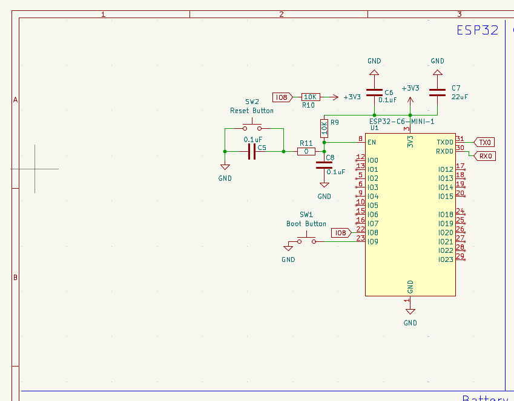  
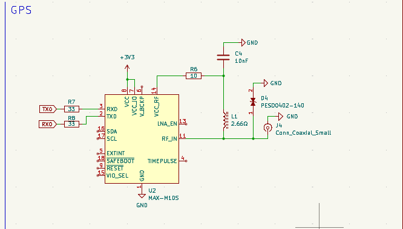  

## Entry 3
In this entry, we've designed the power management system from the batteries to power the rest of the PCB in the kicad schematic.  
It uses a TPS63060 module to either scale the voltage up to 3.3v or down to 3.3v. This allows us to not undervolt the PCB and not overvolt it and inevitably blow something.  
It uses a voltage dividor circut to maintain 3.3v.  
We also added a JST connector to the PCB to make it possible to connect a battery.  
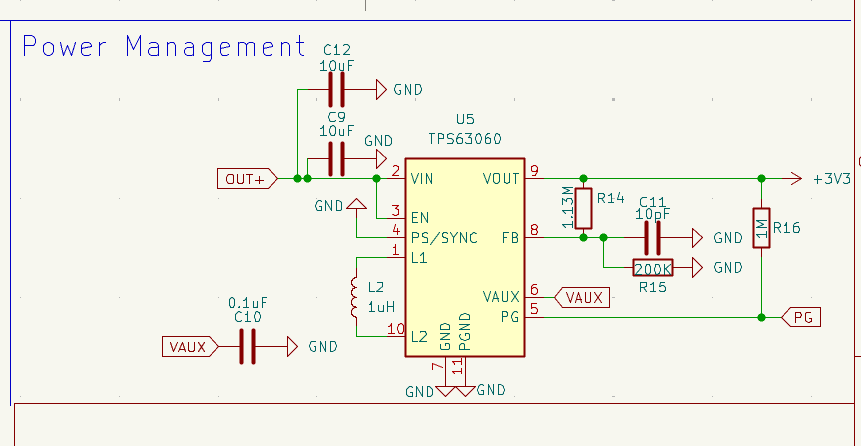  

## Entry 4
In this entry, we converted the schematic into an actual kicad PCB. This means it's no longer a plan, it can be an actual thing.  
I've placed all the components in their position. Organised the PCB and routed it.  
Also, I've added a CP2102 serial UART to usb chip to the PCB as well in this entry.  
This allows us to establish a serial connection to the ESP32 over USB instead of directly connecting to the RX0 and TX0 pins on the ESP32. This should make flashing firmware and debugging much easier, just incase, there are still testpoints on the board for RX0 and TX0.  
And I defined the Edge Cuts in the PCB in this entry as well.  
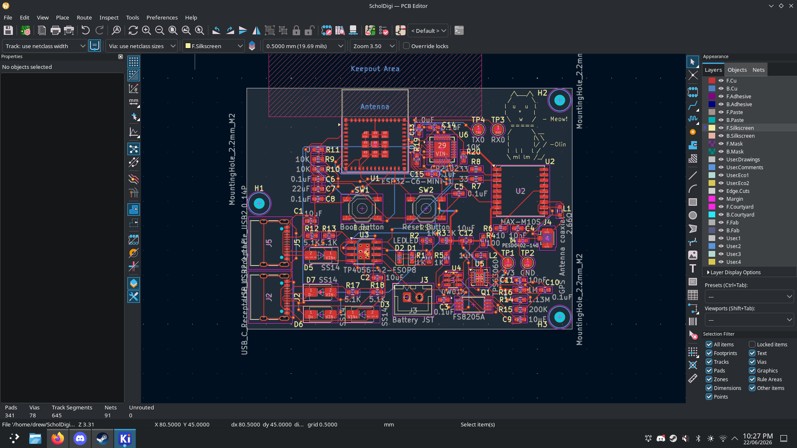  
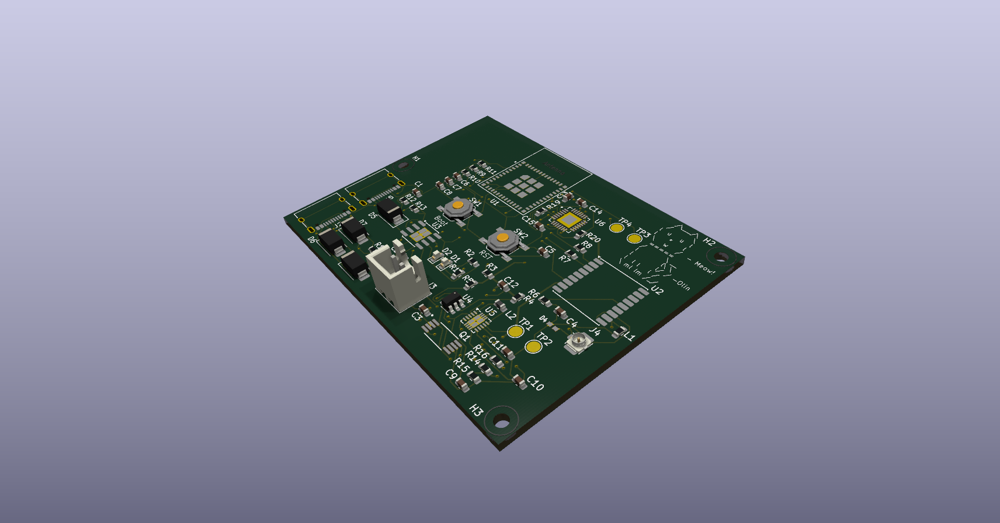  

## Entry 5
In this entry, I designed the case for the device in Fusion 360.  
It has space for the PCB and batteries. The only thing I haven't added in yet is space for the antenna which I'll cross that bridge after I get my hands on the PCB.  
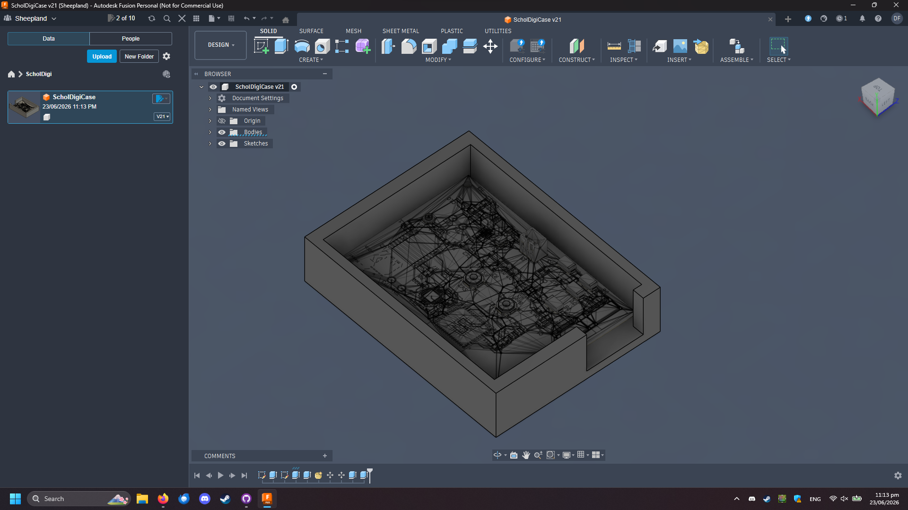  
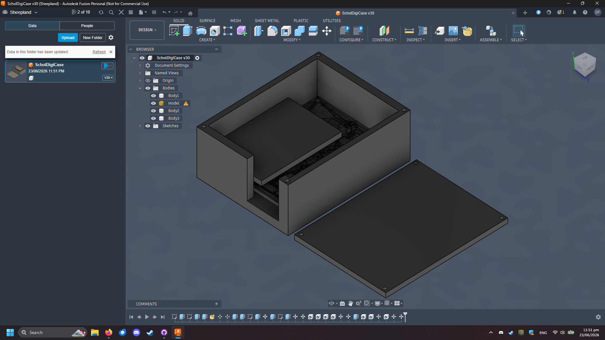  

## Entry 6
In this entry, I added thru hole pins on the PCB board to allow us to connect and I2C OLED display to the ESP32 to run a display. I've been planning to run a 0.96" OLED display with the device to display basic statistics and info to the user.  
  

## Entry 7
In this entry, I added a voltage dividor from the battey JST to allow the ESP32 to measure the voltage of the battery.  
The reason I needed a voltage dividor is because a lithium battery can have it's voltage range from ~3v-4.2v depending on the remaining charge.  
If I put 4.2v straight into the GPIO pins of the ESP32, it would overvolt the ESP32 and blow something on it.
To prevent that, we run a 10x voltage divider on it (yes I know, very agressive) and this allows us to safely measure the voltage on the ESP32.  
I also swapped around some of the footprints due to part selection issues during fabrication (I've had a look at fabrication now because I wanted a quote from JLCPCB).  
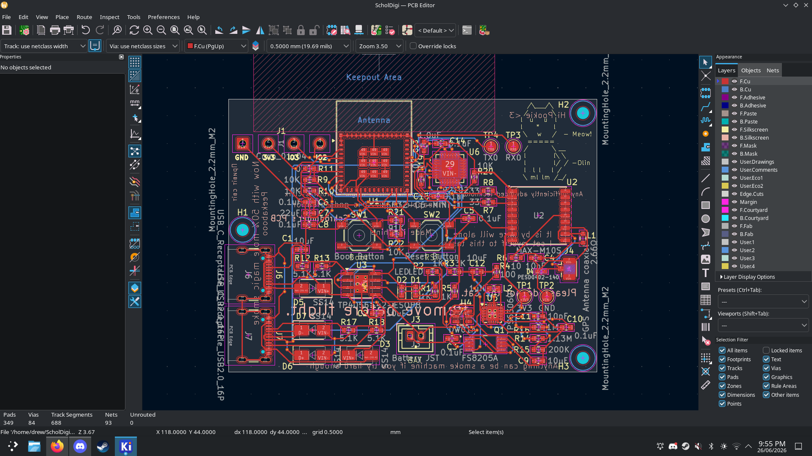  
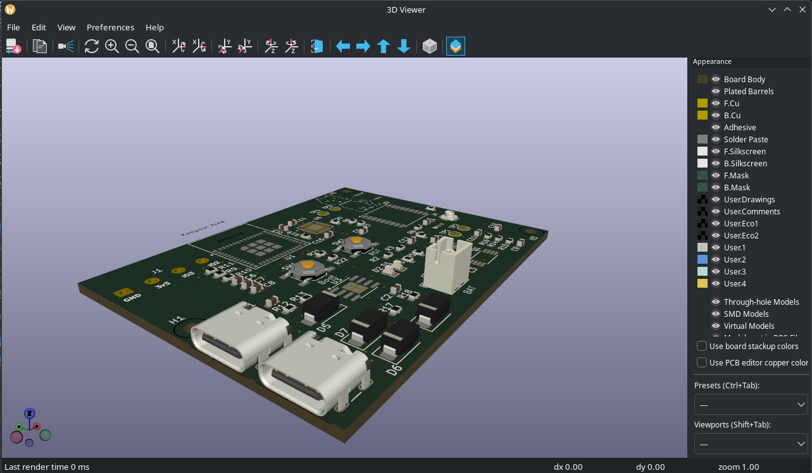  
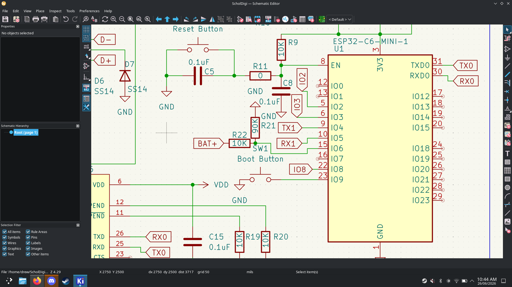
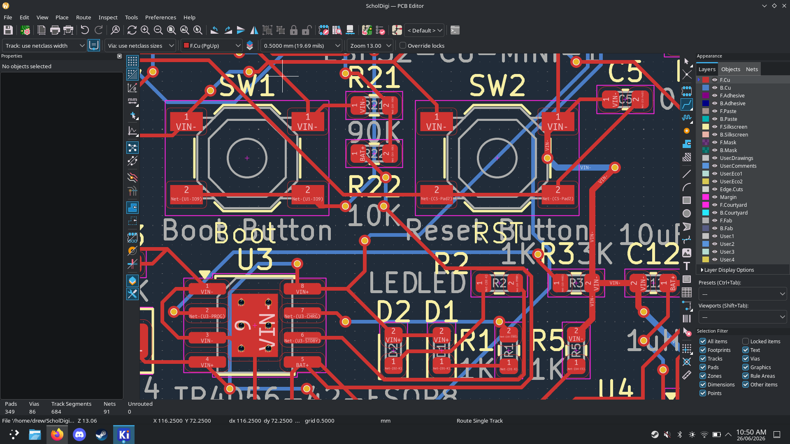  
