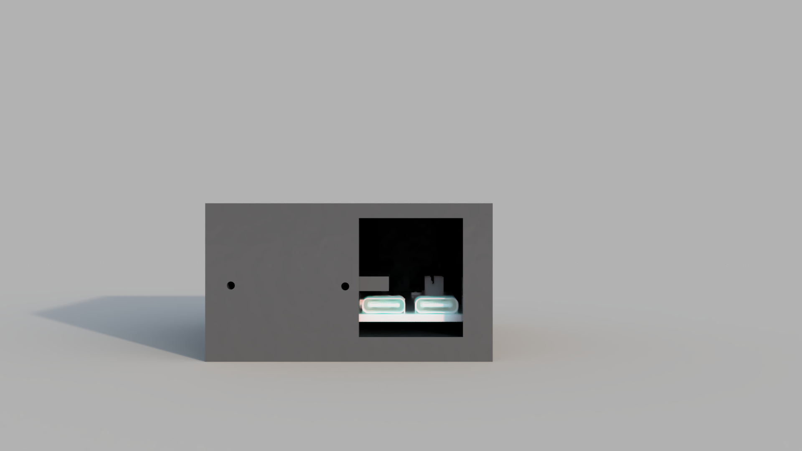
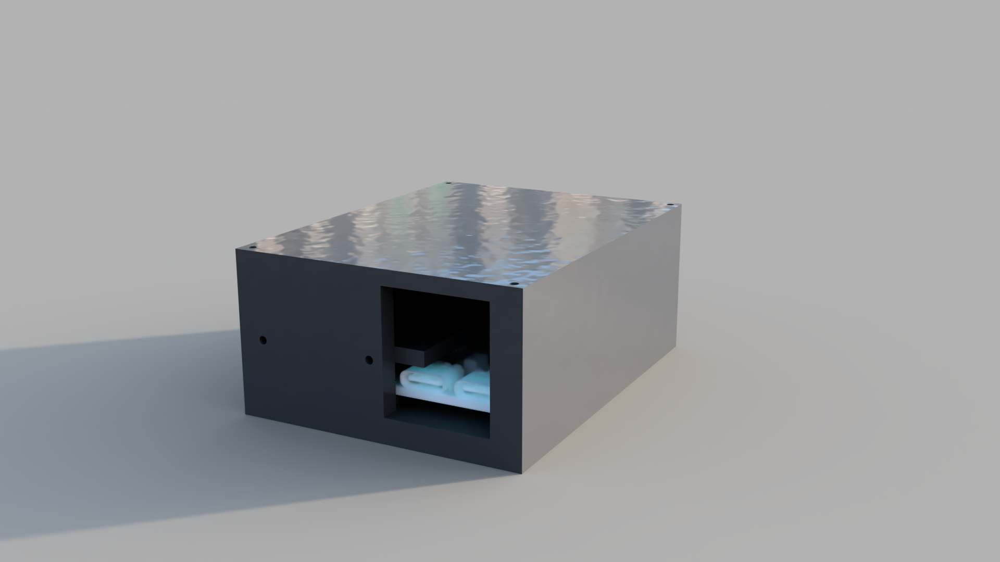
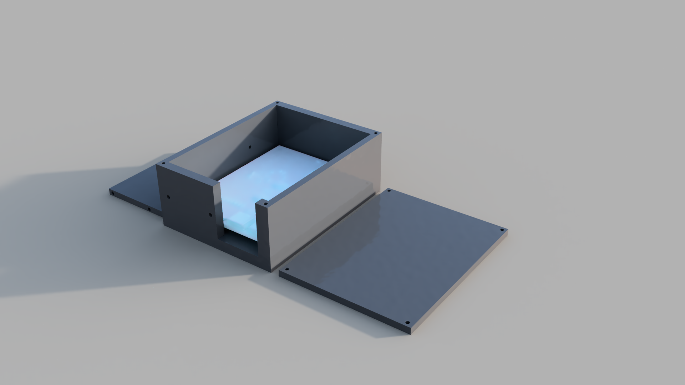
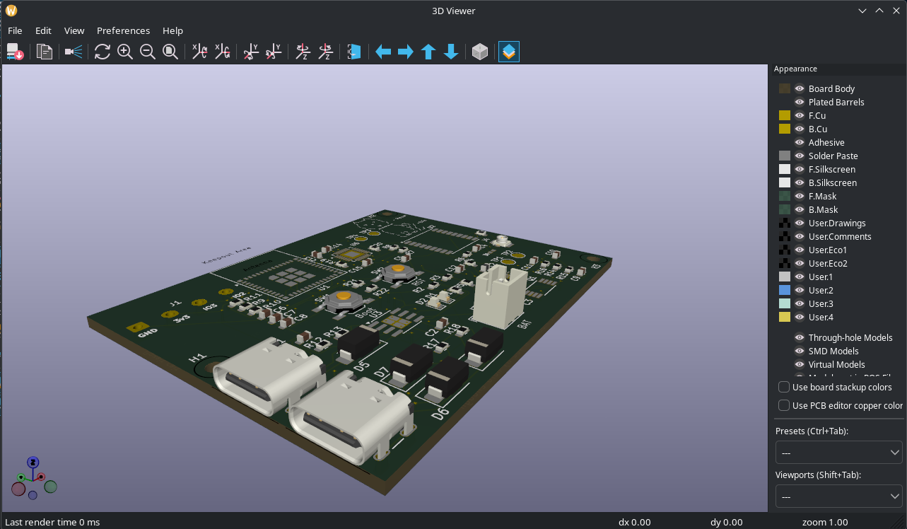

# Scholarship Digitech.
This is my NZQA scholarship technology project.  
It is a small device which can fit in your pocket or bag, and will track your tramping, hiking, walking, running, cycling, skiing, etc.  
It uses a Ublox max-m10s gpu module on a fully custom pcb, with an esp32-c6, battery management system, power management system, serial connection and 2 usb ports for 2 different reasons (one is charging the other is flashing firmware which can also be done from testpoints in case there is too much signal interference).    

This project took inspration from apps such as Strava, however it aims to tackle one of the main issues with Strava which is the fact that it uses your phone. Strava is known to drain phone batteries and on many phones just not work well, this project aims to replace it with a dedicated device with a high accuracy GPS and long battery life allowing it to combat the various issues with fitness apps such as Strava.    

The purpose of this project, was to make an open source fitness tracker for cheap. The point is the motivate communities to improve their fitness and wellbeing without having them spend hundreds of dollars on something like a Garmin or Samsung smart watch and for it to be easy. Something small you can put in your pocket or bag which can last a long time on battery.  

## Hardware
Microcontroller | ESP32-C6-Mini  
GPS | Ublox MAX-M10S GPS module  
Battery management | TP4056 lithium battery charger  
Power management | TPS63060 voltage step down or step up buck converter  
CP2102 | Serial UART to USB  

(For a full list of hardware and pricing visit the )

## Render

